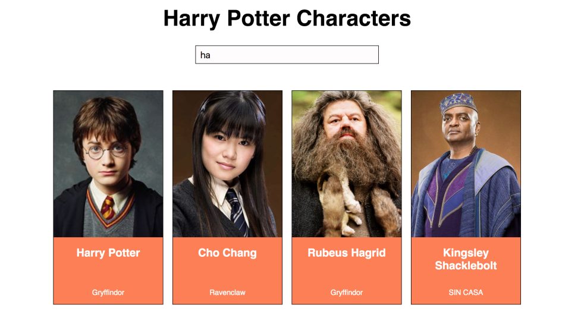
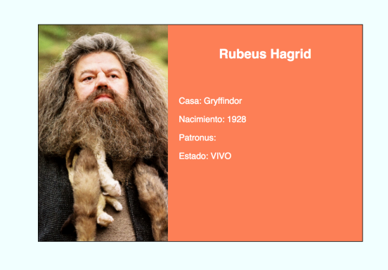

# Ejercicio de evaluación - Sprint 3

El ejercicio consiste en desarrollar una página web con un listado de personajes de Harry Potter, que podemos
filtrar por el nombre del personaje. Vamos a usar React para realizarlo.

## Sobre la autora:

Puedes espiarme en:

## Prerequisitos

Antes de empezar, creamos un nuevo repositorio desde GitHub Classroom. Una vez creado, lo
clonamos en nuestro ordenador y en la carpeta creada empezaremos a trabajar en el ejercicio.

- npm install
- npm start

## Al turrón

Este es el aspecto de la aplicación:

### Listado de personajes

En primer lugar, vamos a realizar una web con el listado de personajes de Harry Potter. Para eso, vamos a
utilizar el servicio de https://hp-api.herokuapp.com/ que nos devuelve información sobre 25 personajes de la
saga. Sobre cada uno, vamos a pintar al menos:
- nombre
- foto
- casa

Para esta primera parte del ejercicio es suficiente pintar la información sin maquetar.

### Filtrado de personajes
Ahora que ya tenemos el listado de personajes en pantalla, la segunda parte consiste en poder buscarlos por
nombre. Para eso, añadimos un **input** a la interfaz, de forma que al ir escribiendo un nombre queden en la
interfaz solo los personajes cuyo nombre contiene las letras escritas. En el pantallazo de arriba, al escribir una
'ha' aparecen personajes cuyo nombre completo contiene esa letra.

### Componentes del listado de personajes
El listado tendrá los siguientes componentes como mínimo:
- Componente para los filtros
- Componente para el listado
- Componente para la tarjeta de cada personaje del listado

### Detalle de personajes
Se va a implementar una nueva funcionalidad: al hacer clic sobre la tarjeta de un personaje, su información
aparecerá a pantalla completa. Para hacer esto usaremos rutas y React router. En la pantalla de detalle
aparecerá además de nombre, foto y casa, el año de nacimiento, el patronus y si está vivo o muerto al final de
la saga.

### BONUS: Mejoras visuales

Para terminar, se realizarán  algunas mejoras visuales del ejercicio. Por ejemplo:
mostrar la casa y si un personajes está muerto con un icono
usar algún sistema de grid para pintar el listado de personajes
que funcione bien el responsive en dispositivos pequeños
